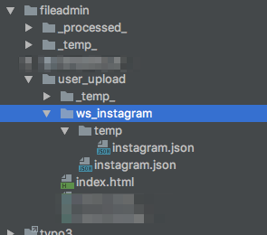
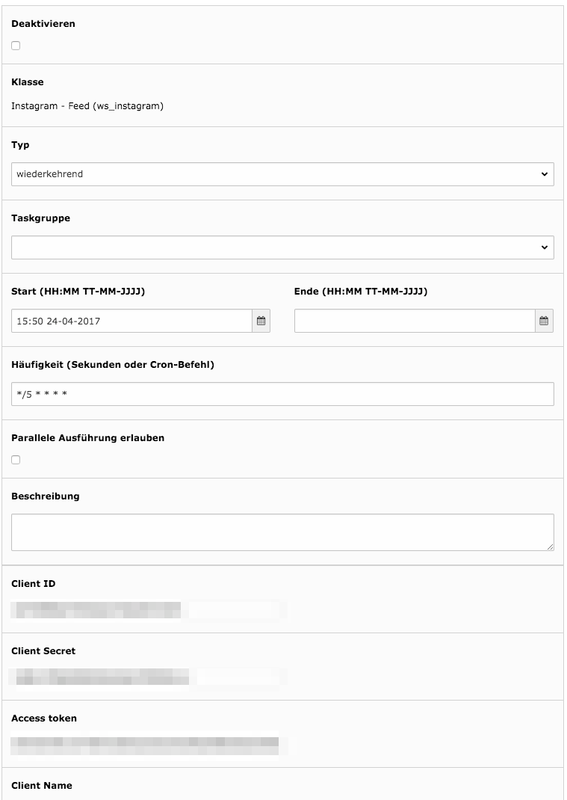

.. include:: ../Includes.txt

.. _admin-manual:

Administrator Manual
====================

.. _admin-installation:

Installation
------------

Its recommended to create your app on instagram first. You'll need a instagram account to do this.
1. Go to https://www.instagram.com/developer/
2. Login with your instagram account
3. Register a new Client (Manage Clients > Register a New Client)
4. Givem a Application name, write a description
5. The redirect URI should look like this (according to your domain) http://www.domain.tld/?eID=instagramCallback
6. You'll get a Application ID and an Application Secret
7. If you do these steps on the instagram account you want to display on your page - your finished here. Otherwise add
the required user account under "Sandbox"
8. (if you added a user to sandbox, login with those credentials and grant the access)

Go back to the TYPO3 Backend and install the extension, perform the following steps:
1. Go to the Extension Manager
2. Install the extension
3. Edit the settings in the Extensionmanager and enter the same settings you did on the developer plattfrom from
instagram
4. Include the static template
5. Now we need to create an access token for your application
6. Use the Callback-Eid Script to generate an login url to your application http://www.domain.tld/?eID=instagramCallback
7. The script will give you a new URL. Load this page in a browser.
8. After this you should get the access token for your api access.
9. Create a new folder in your fileadmin (or elsewhere) and create also a temp-Folder. (Look at the screenshot)
10. Go to the scheduler module and create a new task
11. Choose "Instagram - Feed"
12. Enter your Client ID, Client Secret, Access Token, Client Name, Folder and File
13. Folder: should be absolute to your installation p.E. /home/apache2/public_html/fileadmin/user_upload/
14. File: p.E. instagram.json
15. Save and test the task. If successfull the task creates a temporary file with your stream in the defined folders

.. _admin-configuration:

Configuration
-------------

To configure the frontend plugin you can either do that in the flexform itself or via typoscript.