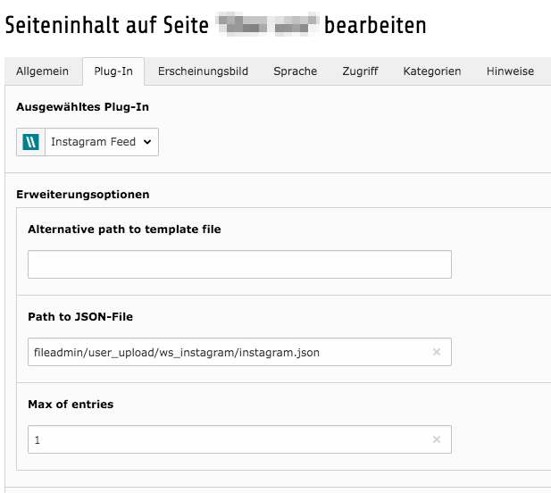
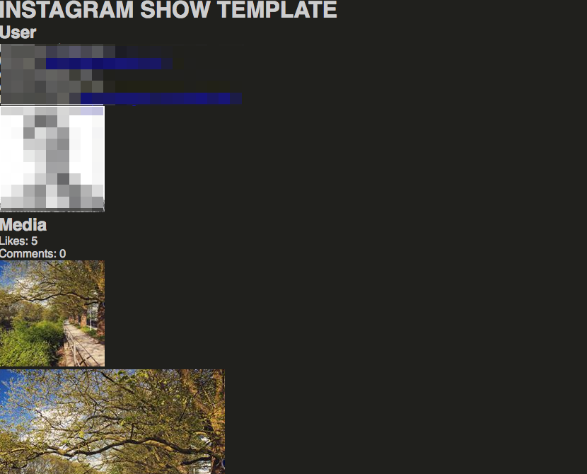

.. include:: ../Includes.txt

.. _introduction:

Introduction
============

.. _what-it-does:

What does it do?
----------------

With this extension you can access your instagram feed and output it on your website. Its also possible if your account
is private. You need to create an app on https://www.instagram.com/developer/ and grant access to your feed.
Data is fetched with a scheduler task to reduce api calls and improve performance.

.. _screenshots:

Screenshots
-----------

.. figure:: ../Images/SchedulerTask.png
   :width: 500px
   :alt: Scheduler Task

